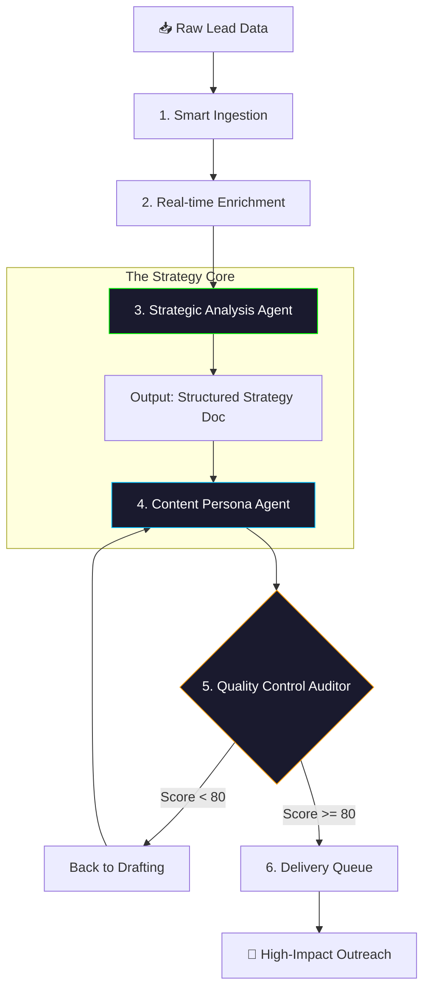

# 📧 Outreach Architect Pro
### **OutreachPro** — Autonomous Precision-Targeted Sales Intelligence Engine

<br/>

[](https://reactjs.org)
[](https://python.org)
[](https://github.com/taha-codes09)
[](LICENSE)

<br/>

> *"Most outreach is a numbers game. OutreachPro makes it a precision strategy."*

**Outreach Architect Pro** transforms cold outreach from a generic numbers game into a **high-precision targeting system**. Developed for modern sales teams, it leverages advanced AI and real-time data enrichment to achieve significantly higher response rates. This is an autonomous platform that researches, strategizes, and drafts hyper-personalized engagement sequences.

[**✨ Features**](#-key-features) · [**🏗️ Workflow**](#-the-multi-stage-agentic-workflow) · [**🚀 Get Started**](#-installation--setup) · [**📫 Contact**](#-contact)

---

## 🏗️ The Multi-Stage Agentic Workflow

The system operates on a sophisticated **Research-Strategize-Audit** loop, ensuring every email feels like it was written by a personal assistant.



---

## ✨ Key Features

- **Smart Data Enrichment:** Automatically fills missing company data, recent news, and pain points from live sources.
- **Autonomous Strategy Agent:** Generates a unique engagement strategy for every lead based on "Cognitive Hooks."
- **Kimi 2.5 Integration:** High-context reasoning and hyper-personalized content generation.
- **Auditor Feedback Loop:** An internal "Quality Control" agent that scores drafts and demands revisions.
- **Lead Dashboard:** Real-time tracking of outreach status from "Ingestion" to "Converted."

---

## 🛠️ Tech Stack

| Tier | Technology | Purpose |
| :--- | :--- | :--- |
| **Frontend** | React, Vite, Framer Motion | Premium, responsive operator dashboard |
| **Backend** | Python, FastAPI | High-performance agent orchestration |
| **AI Engine** | Kimi 2.5 LLM | Strategic reasoning & content generation |
| **Web Data** | Selenium / Scrapers | Real-time lead and company enrichment |

---

## 🚀 Installation & Setup

### Prerequisites
- Python 3.10+
- Node.js 18+
- Kimi / OpenAI API Credentials

### Backend Setup (outreach-architect)
```bash
cd outreach-architect
pip install -r requirements.txt
cp .env.example .env  # Configure your keys
python main.py
```

### Frontend Setup (app)
```bash
cd app
npm install
npm run dev
```

---

## 🗺️ Roadmap
- [ ] Multi-channel support (LinkedIn DMs, Twitter).
- [ ] A/B Testing Engine for Agent Personas.
- [ ] Direct Integration with HubSpot & Salesforce.
- [ ] Voice synthesis for autonomous follow-up.

---

## 📄 License

This project is licensed under the MIT License - see the [LICENSE](LICENSE) file for details.

<div align="center">

</div>

---

---

---

---

---

## Author & Contact
- **Author**: Muhammad Taha
- **GitHub**: [@taha-codes09](https://github.com/taha-codes09)
- **Email**: [taha.coder.work@gmail.com](mailto:taha.coder.work@gmail.com)
- **Profile**: [https://github.com/taha-codes09](https://github.com/taha-codes09)

Developed by Taha
